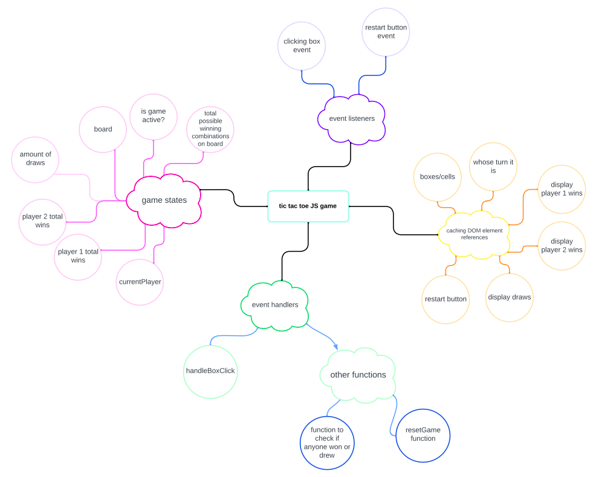
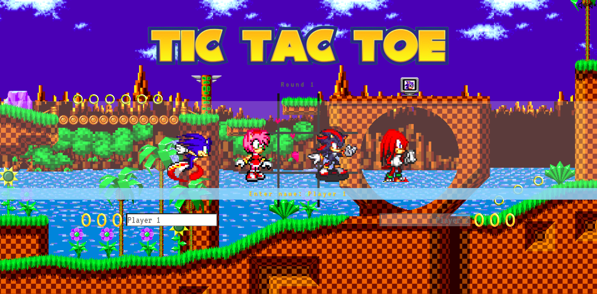
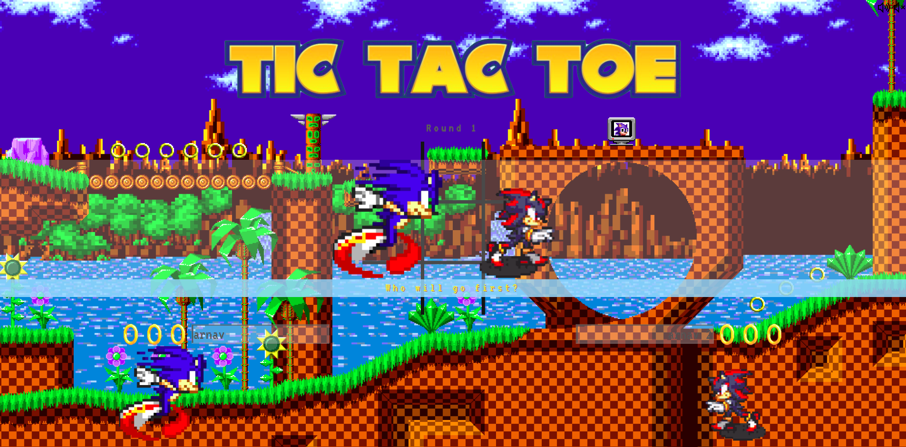
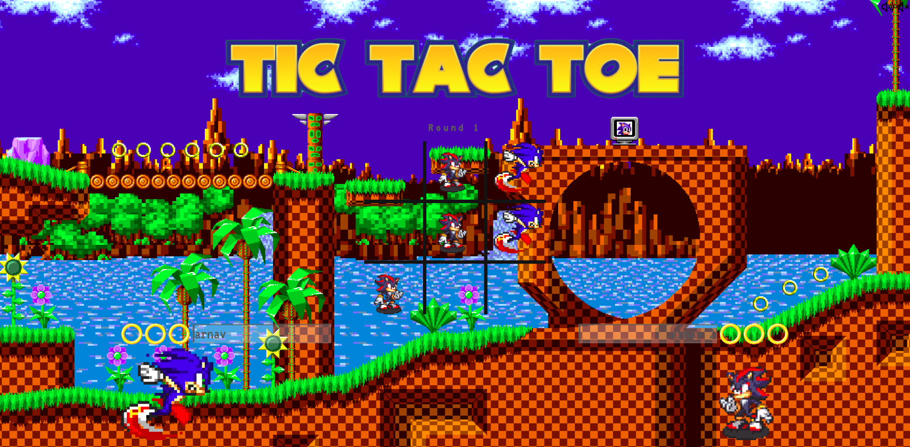
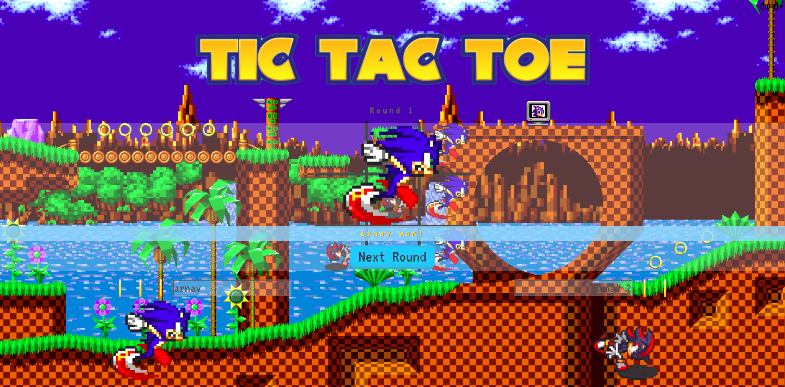

# Tic Tac Toe

## About
A responsive Tic Tac Toe game with a Sonic The Hedgehog theme. Made using HTML, CSS and Vanilla Javascript.

## Features
- name inputs
- round counter
- who goes first
- 3 lives to determine who wins
- background music: play/mute

## Screenshots

## Getting Started
Download Instructions:

Download the repo at [repository](https://github.com/yangzhie/tictactoe)

How to download the repo:
> $ git clone tic_tac_toe

> $ cd tic_tac_toe

> $ node tic_tac_toe.js

## Next Steps
Items that still need to be worked on: 
- ~~Javascript code~~
- ~~Upgrading the CSS to not be basic~~