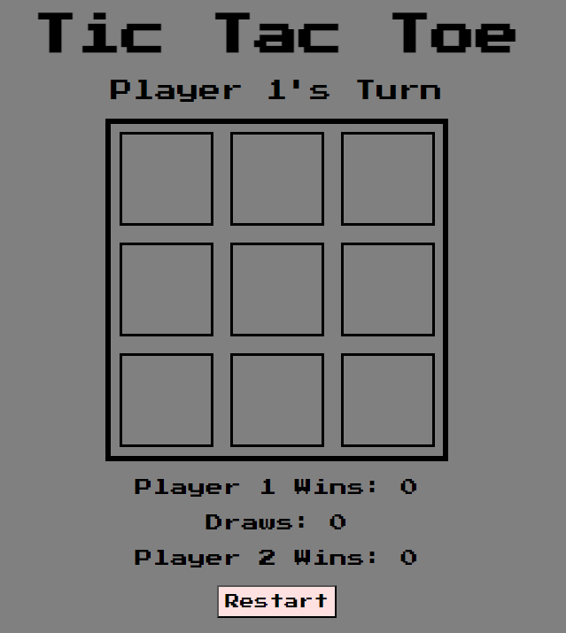
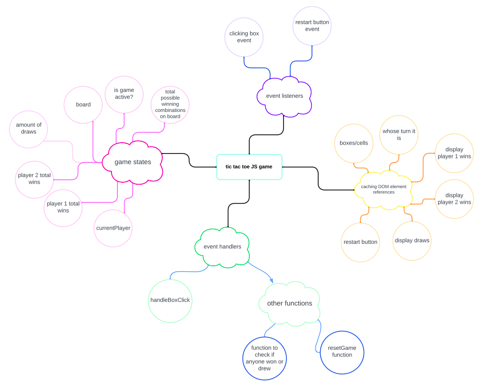

# This is my tic_tac_toe application readme.md file!

## About
The project is just a very basic tic tac toe game coded in HTML, JavaScript and CSS.

[Link to the game](https://yangzhie.github.io/tictactoe/)

## Getting Started
Download Instructions:

Download the repo at [repository](https://github.com/yangzhie/tictactoe)

How to download the repo:
> $ git clone tic_tac_toe

> $ cd tic_tac_toe

> $ node tic_tac_toe.js

To play, press any random box on the game board and that will be counted as a player 1 move.
On the second click, it will be player 2's move and the game will continue in that fashion until
the game is either won by a party or drawn.

## Next Steps
Items that still need to be worked on: 
- ~~Javascript code~~
- ~~Upgrading the CSS to not be basic~~